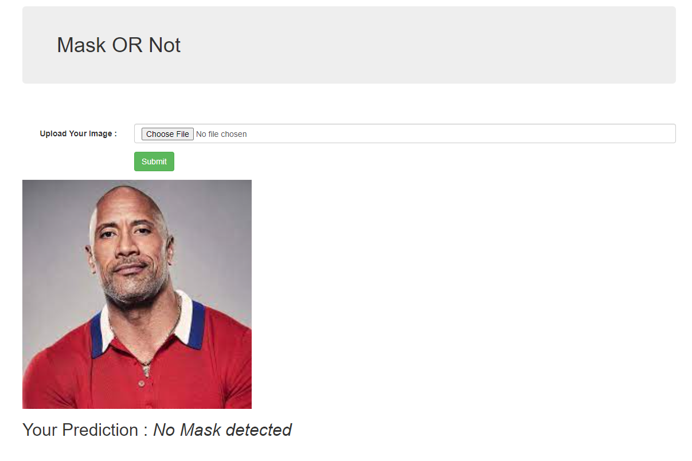
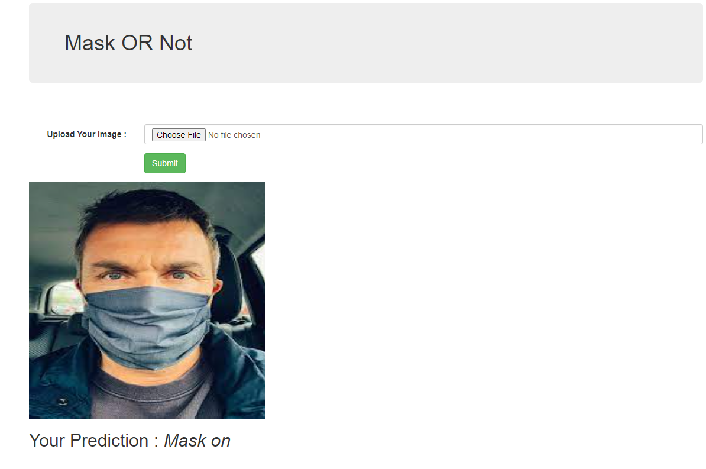

# Mask-or-Not
Upload a photo to detect if subject is wearing a mask or not!

[https://maskornot.herokuapp.com/](https://maskornot.herokuapp.com/) 

Check the above site to see the web app.

# ScreenShots
<pre>
</img></img>

</pre>

# Intruction
Upload a high quality photo of a person with or without mask and the model will predict it.

`Since the data sets were limited the model doesnt predict correctly if photo of BEARDED PERSON is uploaded!`

## installation

clone this repository to your computer

  `cd <projectdir>`
  
  `pip install -r requirements.txt`
  
  after installing required packages,run the flask model
  
  `python -m flask run`
  
- [model](./classificationproject.ipynb) trained in colab.

if you have any issue with the webclient do try it out by cloning and folowing the above steps for installation.

### ❤️ Made as final project for TinkerHub Practical-AI-Bootcamp

